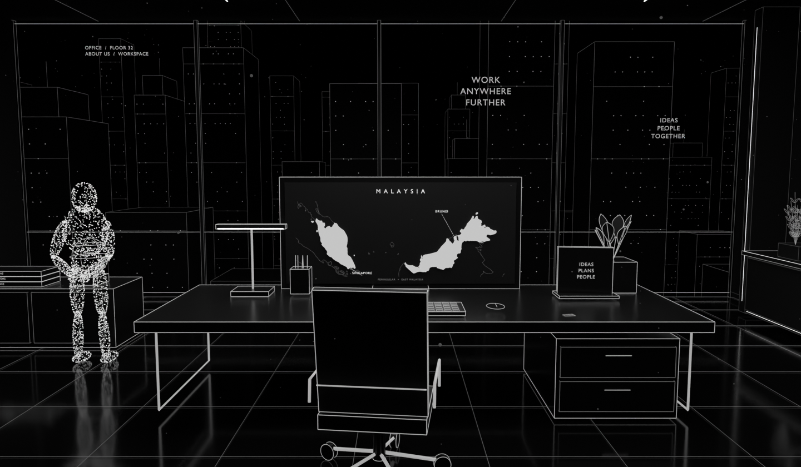

# About office

**`about-office.blend`** is the single authoring file for the skyline office, with one `.blend1` previous-save backup. The scene is **ABOUT / Skyline Office**. Its authored presentation camera faces the center of the computer. The browser adds smooth 360° drag/free-look from that fixed position, arrow-key look controls, and R/Reset look to return to the computer. The flat business card has an idle shine cue and a separate contact-focus camera.

In the website's About room, click the **Observer** for the Identity/Portrait/Record dialog, or the desk card for contact details. Accessible equivalents are **Meet the Observer** and **View business card**.

The 360° interior has a rounded orbital-art panel, long low console and narrow end bookshelf on the right; a minimal embedded aquarium with flowing end-planted leaves on the left; and a plain rear wall surrounding the elevator passage. In the browser, turn toward the rear elevator and click its doors or the wall-mounted call panel beside them to return to floor selection. Skyline glazing remains ahead of the workstation.

The computer display shows a black-and-white Malaysia map: white Peninsular/East Malaysia, faint neighboring outlines and Brunei/Singapore labels. Public-domain Natural Earth geography is authored as native planar shapes/curves/text, with the original screen's UV target retained. [Screen detail](office-screen.png).

- [Agent instructions](AGENTS.md)
- [Room design, card and Observer interactions](DESIGN.md)
- [Build/export/checks](WORKFLOW.md)
- [Integration](../journey/README.md)

