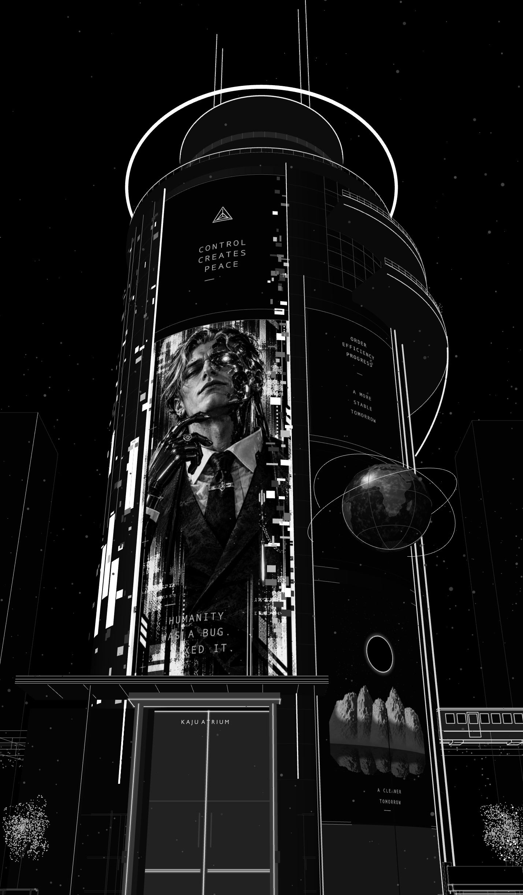

# City design and motion

The hero building is one continuous cylindrical tower, fitted to the fixed entrance at `(-1.5,-5.55,0)`. The source specification uses metre-scale Blender Z-up coordinates and azimuth `x=R sin(phi), y=-R cos(phi)`. `reference_tower_spec.py` owns the site fit: radial scale 0.43, a separately tuned facade-height scale, and a raised base that keeps the portrait above the established 7.65 m doorway.

The raised A bay spans azimuth -40 to +9 degrees, with a separate triangular-logo / CONTROL / CREATES / PEACE panel above the head-to-suit portrait. HUMANITY / WAS A BUG. / I FIXED IT. is overlaid on the lower-left suit. The +9 to +15 degree channel is recessed. The right bay spans +15 to +58 degrees and carries the ORDER slogans, shaded hologram and eclipse landscape. Each texture's aspect is derived from actual arc length divided by panel height, with cylindrical UVs. Glitch blocks and larger glowing rectangles wrap the shadowed left face; the right edge of A has a separate narrow glitch strip.

The crown has a setback drum with two glass bands, a bright top rim, a floating horizontal halo, a full circular parapet railing, four unequal paired antenna masts and two short central stubs. L2 and L1 are separate partial-ring balconies, with a faint upper curtain-wall grid and two sparkle trees on L1. L1's outer rim continues into a downward, inward-sweeping crescent. Two continuous vertical right-edge LED fins run toward the storefront base.

The base has a wide four-band illuminated canopy, recessed working glass doors, KAJU ATRIUM lettering, a dim B storefront and fairy-light trees. Continuous side/header/floor returns seal the recessed vestibule; overlapping leaves close the seam. Fitted fixed pocket casings conceal open leaves from exterior angles. The foreground entrance-obscuring sign remains hidden. All 18 outdoor NPCs are visible: ten animated walkers and eight stationary people, including their phones/bags/accessory outlines. Tower rebuilds preserve this visibility and the existing native actions. Traffic retains its native motion.

`restore_wireframe_skyline.py` restores the retained skyline silhouette network behind the main building. Original tower bounds supply sparse five-metre front/side floor bands; selected window/antenna point groups provide tiny white lights. Stepped crowns and spires retain the original city depth and varied heights. The dense facade particle cloud and two opaque replacement background blocks stay hidden. Native centerlines/points export as separate `skyline` groups with `wireframeSkyline` provenance, without spheres realized into the browser package.

The full authored orbital sky is preserved independently of tower styling: continuous/dotted arcs, the shallow S trajectory, constellation links/stars, tracking stars, optical star highlights and two crescent bodies. Only annotation text and its brackets are hidden. `orbital_sky_reference` retains geometry statistics and publishes `visibleLabels: 0`; tower rebuilds restore sky-object visibility.

`restyle_reference_tower.py` owns the repeatable update; `prepare_reference_tower_artwork.py` owns five packed textures. Native authoring uses metallic Principled skin, glossy-coated emissive screens, a glass/Fresnel hologram, HDR LEDs, Cycles/denoising and a monochrome fog-glow/streak/contrast compositor. Browser exports retain native meshes/points/centerlines, using explicit LDR luminance proxies and emissive tube cores to fit the shared demand-rendered viewer.

The Earth hologram has a separate 2048 × 1024 equirectangular texture with real public-domain Natural Earth coastlines, continent contrast, coherent cloud detail, directional shading and layered specular reflections. Its closed 192 × 96 sphere uses a rear geographic UV seam, faint latitude/meridian engraving and the two larger depth-occluded orbits. `prepare_earth_detail.py` caches the geography and records its source/output hashes in `earth-detail.json`. The facade remains five panels; the geographic sphere adds a sixth textured surface.

[Earth hologram detail preview](earth-hologram-detail.png)

## Reference animation

- 1–450 at 30 FPS: 15 seconds.
- 1–90: stationary rooftop-to-street tilt; no forward travel.
- Then approach the entrance; doors open before crossing.
- Frame 145: foreground train pass.

Rendered viewport shading reproduces the particle/material look. Cycles restarts progressive sampling during movement; pause for convergence or use F12. The browser uses GPU points/lines instead of progressive path tracing.

## Street people

`npc-layout.json` defines 18 people: ten walkers and eight conversation/phone/bag poses. The lobby master supplies slim articulated reference forms; copied points/props are local, not linked-library dependencies. Partners face one another and props follow their owners.

Walkers travel 11–12 m on staggered intervals, with sampled clearance from the complete camera route. `person_id` and per-point radii remain stable. `npc-walking-paths.json` records the baked roots and ranges. Browser `walk` metadata drives additional distance-based foot/arm motion; stopping gestures freezes it and reversing gestures reverses it. Reduced motion keeps translation while disabling extra gait.

## Supporting data

- `walkthrough-camera.json` and `traffic-animation.json`: sampled reference motion.
- `camera-optimization.json`: full-route visibility/optimization report.
- `textures/` and `textures-monochrome/`: original/production art; production images are packed in the master.
- PNG previews document the city, figures, traffic, and production tower.

[Detailed right-side preview](reference-tower-right-side.png) shows the corrected dark shaft, slender balcony edge, shaded orbital globe and eclipse landscape.

Optimization uses all 450 frames with a 15% framing margin. Whole people/tree clusters remain when visible anywhere; off-route fragments can be removed. Rechecking only the initial framing after a route edit is not equivalent.

The actual grand portal and larger lobby cavity belong to the generated [journey integration](../journey/DESIGN.md), not the authored city blockout.
