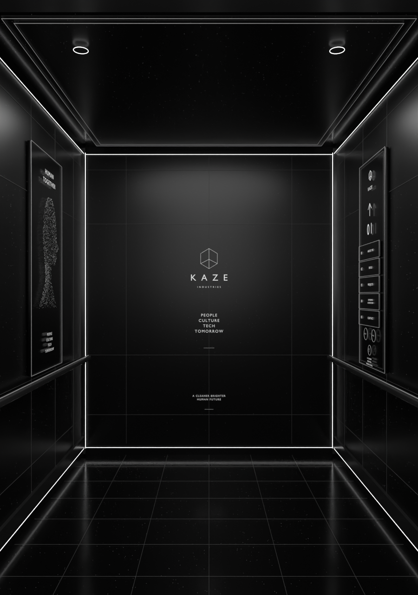

# KAJU elevator

**`kaze-elevator-journey.blend`** is the canonical cabin/camera/door master, with one `.blend1` recovery copy. It contains a monochrome cabin and four bottom-to-top floor choices: About, Skills, Projects, Experience & Education.

The website uses its native browser package and actual 3D switches. Blender review controls are enabled by running the embedded **KAZE_Elevator_Controls.py** once, then opening **N → KAJU Elevator**.

- [Agent instructions](AGENTS.md)
- [Cabin design, controls and choreography](DESIGN.md)
- [Rebuild/export/verification](WORKFLOW.md)
- [Connected journey](../journey/README.md)

