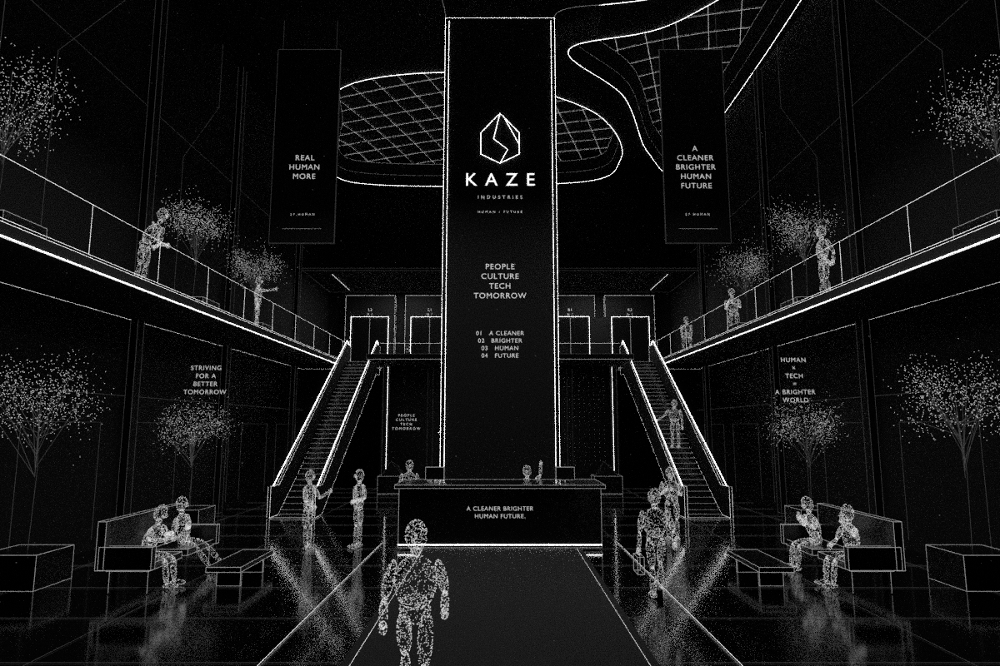

# KAJU monochrome lobby

**`kaze-lobby-walkthrough.blend`** is the single main file, with one `.blend1` previous-save backup. It contains the atrium, reception, central identity pillar, twin escalators, upper elevator foyer, particles, lighting, and the animated entrance-to-R1 route.

Open the master, press **Numpad 0**, start at **frame 1**, and press Space. Static presentation cameras are selectable in Scene Properties.

On the website, NPCs animate automatically while the lobby is visible, even when scrolling stops. Four visitors follow walking → pause/look → return loops; the other people have subtle activity gestures. Routes are editable in `npc_motion.py` (`ROUTES`), with 1019 unique frames at 30 FPS. Camera navigation and elevator doors retain their scroll-driven timing.

Install motion into a static master with `add_npc_motion.py`, then re-export with `assets/journey/export_browser_lobby.py`. Full rebuilds include the motion automatically. Verify with `node --import tsx assets/journey/verify_npc_motion.mts` and `blender --background assets/kaze-lobby/kaze-lobby-walkthrough.blend --python-exit-code 1 --python assets/journey/verify_lobby_npcs.py`.

- [Agent instructions](AGENTS.md)
- [Design, cameras and animation timing](DESIGN.md)
- [Rebuild, export and interior handoff](WORKFLOW.md)
- [Shared integration](../journey/README.md)
- [Planned banner videos and preloading](../../docs/roadmap.md)

