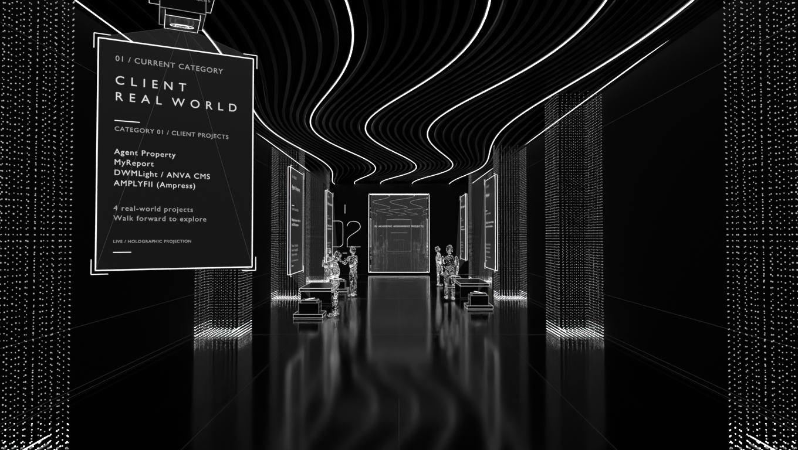

# Project Hallway

**`project-hallway.blend`** is the editable 16-project exhibition in three ordered categories, with 15 animated particle visitors and a clear fixed-axis corridor. The website connects it to Level 03. Client / real-world starts open; automatic luminous portals introduce Academic Assignment and Personal Project. Walk straight through them; top-right text shows the current category. FYP leads Academic as one featured exhibit with three repositories. Cards and expandable details are generated from [the approved project catalogue](../../docs/project-catalogue.md).

Use Numpad 0 and Rendered shading. The saved free-look camera is unanimated; Space plays native NPC motion. Embedded **hallway_controls.py** adds independent walking/look after explicit execution.

- [Agent instructions](AGENTS.md)
- [Design, content and interaction](DESIGN.md)
- [Build/export/verification](WORKFLOW.md)
- [Archived meeting-room authoring source](meeting-room/README.md) (not used by the website)
- [Connected journey](../journey/README.md)

