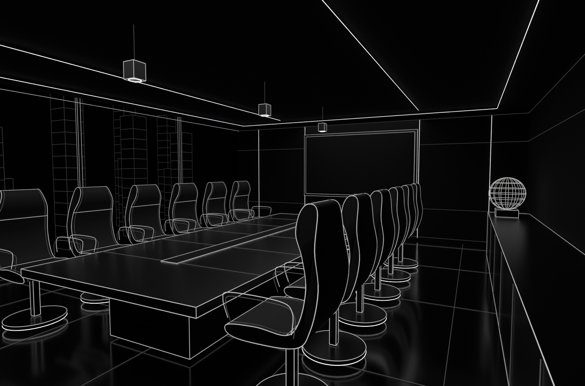

# Archived project meeting room

This authored office meeting-room model is retained for reference. The website scene, View more controls, dynamic project presentation and `public/models/rooms/project-meeting/` package have been removed. Project details and repository links are shown in the Projects hallway sidebar.

The reference-inspired model has a long dark conference table with a recessed cable channel, twelve curved ergonomic chairs on illuminated circular bases, a glazed wire-city outlook, a double-framed presentation screen, low cabinetry, a wire globe and integrated ceiling/wall light strips. It has no visitors or spotlight fixtures.

## Authored master and preview

`project-meeting-room.blend` is generated by the local builder. Local coordinates use Blender Z-up; `room.json` retains the historical exporter configuration. The model's presentation screen is a UV quad without a baked project texture.

```sh
blender --background --python-exit-code 1 --python assets/project-hallway/meeting-room/build_meeting_room.py
```

Add `-- --no-render` to the builder to skip the preview. Full generation replaces this room's master, so preserve manual edits before rebuilding. Do not export this archived model into the website's public assets; room-package verification checks that the retired package is absent.


