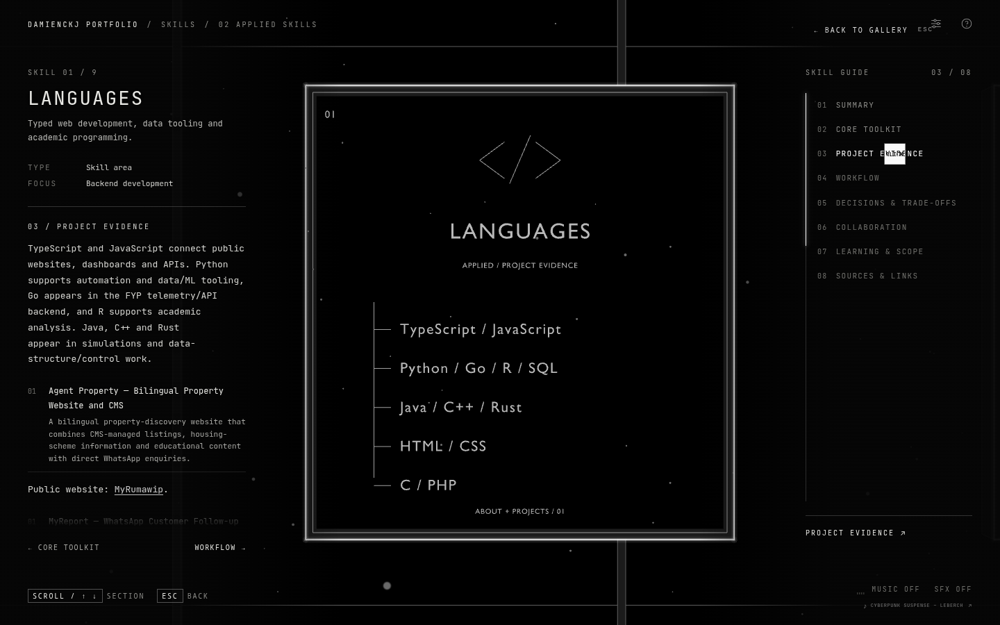
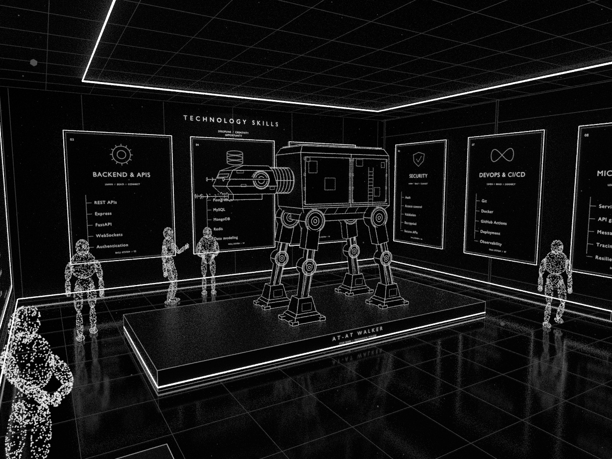

# Skills Gallery

**`skills-gallery.blend`** is the single authored museum file, with one `.blend1` recovery copy. Nine illuminated skill exhibits surround a reference-led AT-AT walker and six particle visitors. The walker uses black armor, fine white contours, a ribbed neck, twin chin/side cannons, and four mechanical legs.

The active **Gallery • Guided walk / free-look camera** starts at frame 1. Space moves its player rig through all exhibits without auto-aiming. For interactive mouse look, run embedded **Gallery Walk Preview.py** once, then use **N → Gallery Walk**.

- [Agent instructions](AGENTS.md)
- [Room, walker, visitor motion and controls](DESIGN.md)
- [Build/export/verification](WORKFLOW.md)
- [Connected journey](../journey/README.md)

Level 02 uses the completed About toolkit and Projects catalogue instead of concept lists. Nine areas cover languages, frontend frameworks, backend/APIs, databases, data/AI, security, DevOps, microservices and Linux. Project-backed examples, profile-only tools and ongoing learning are stated separately.

Click a skill card or choose its sidebar entry to open the exact v2 case-file shell shared with Projects: the full card in the middle, information on the left and section navigation on the right. Eight sections explain toolkit, project evidence, workflow, trade-offs, collaboration and learning scope. Back/Escape restores the original route/look and tour pause state; the AT-AT remains a separate sculpture exhibit.

Generate approved content with `node --import tsx scripts/build_skills_catalogue.mts`; it reads canonical `src/data/portfolio.json` directly and hashes its bytes for profile provenance. Use the content-only refresh in [WORKFLOW.md](WORKFLOW.md) to preserve the master and its performances.

