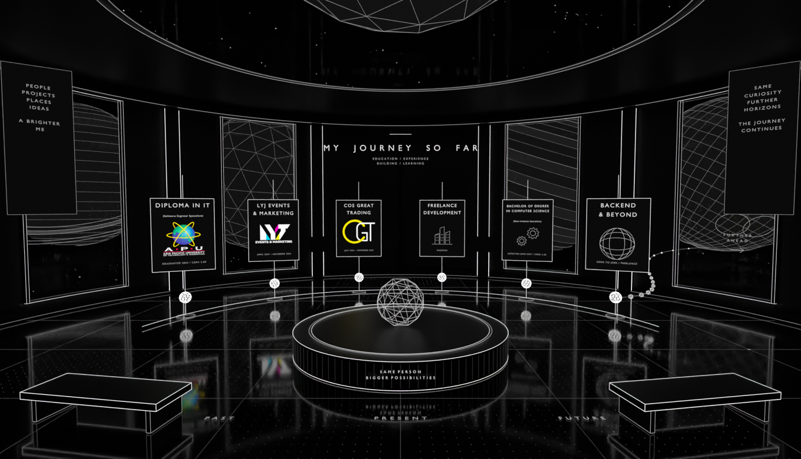

# Timeline Observatory

**`timeline-observatory.blend`** is the authored circular, NPC-free Experience & Education room. Six timeline displays surround a globe/dais, observation windows and exterior planets. The website connects it to Level 04.

The displays now contain confirmed APU education, LYJ/COS employment, freelance MyRumawip/DWMLight/Amplifii work and current focus. Selecting a card or timeline entry opens the same three-column case-file layout as Level 03: left information, centred native card and right section menu. Scroll/arrow keys navigate sections; Back/Escape restores the saved observatory route/look. Mobile uses the shared section selector and reading dock.

Numpad 0 and Space preview the 2400-frame guided position route. Look stays independent; run embedded **observatory_controls.py** once for interactive mouse capture and separate walking pause.

- [Agent instructions](AGENTS.md)
- [Design, celestial motion and controls](DESIGN.md)
- [Build/export/verification](WORKFLOW.md)
- [Connected journey](../journey/README.md)

